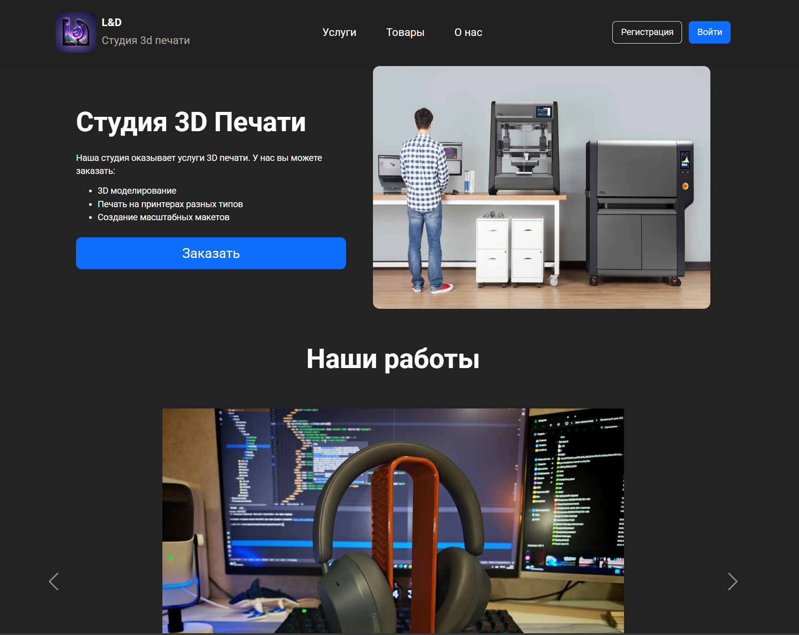

# 3D Print Service Platform

Сервис для заказа услуг 3D-печати. Проект находится в активной разработке.



## 🚀 Функциональность

### ✅ Реализовано:
- **Система аутентификации**
  - Регистрация пользователей
  - Авторизация/аутентификация
  - Система логирования действий
- **Административная панель**
  - Управление услугами (добавление/редактирование/удаление)
  - Управление товарами (добавление/редактирование/удаление)
  - Просмотр логов системы
  - **Каталог товаров/услуг**
  - Просмотр каталога товаров и услуг
  - Возможность заказа услуги

### 📋 В разработке:
- Система заказов и корзина
- Личный кабинет пользователя
- Платежная интеграция
- Система уведомлений
- API для внешних сервисов

## 🛠 Технологический стек

**Backend:**
- Django 4.2+
- Django REST Framework (планируется)
- PostgreSQL

**Frontend:**
- HTML5/CSS3
- Bootstrap 5
- JavaScript (Vanilla)

**Инфраструктура:**
- Docker
- Docker Compose
- Nginx
- Uvicorn

## 📦 Установка и запуск

### Предварительные требования:
- Docker 20.10+
- Docker Compose 2.0+
- Django

### Запуск в development режиме:

1. Клонируйте репозиторий:
```bash
git clone &lt;repository-url&gt;
cd mysite
python manage.py runserver
