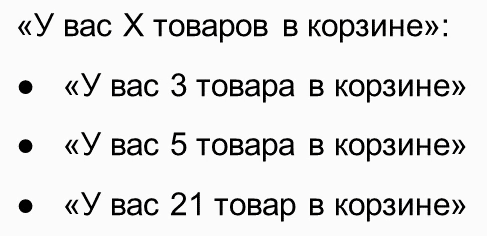

# Интернационализация и локализация приложений django
Интернационализация I18N - это использования особых форматов строк, что может приводить к отдельных частей приложения 
для локализации

Локализация - это процесс перевода интернационализованного приложения под конкретные регионы что включает в себя перевод,
изменение формата даты или валюты, а также значков и иконок 

## Первичная настройка локализации
Настройки интернационализации находятся в папке settings
```python
# Internationalization
# https://docs.djangoproject.com/en/4.0/topics/i18n/

LANGUAGE_CODE = 'en-us'

TIME_ZONE = 'UTC'

USE_I18N = True

USE_TZ = True

USE_L10N = True

```
Для настройки локализации необходимо указать USE_L10N и флаг True

Также необходимо указать путь куда django будет складывать сгенерированные файлы с переводом
```python
LOCALE_PATHS = [
    BASE_DIR / 'locale/'
]
```
## Интернационализация
Для того чтобы сделать перевод станицы необходимо импортировать gettext
```python
from django.utils.translation import gettext as _

class HelloView(View):
    def get(self, request: HttpRequest) -> HttpResponse:
        welcome_message = _("Hello world")
        return HttpResponse(f"<h1>{welcome_message}</h1>")
```
После передачи в gettext строчки необходимо создать файлы локализации командой python manage.py makemessages -l ru
При выполнении команды создаться папка locale которую необходимо проинициализировать в настройках 

```python
LOCALE_PATHS = [BASE_DIR / 'locally/']
```
Далее необходимо выполнить компиляцию файлов для применения локализации в приложении командой python manage.py compilemessages

Для того чтобы указать какие языки будут использоваться в приложении необходимо в настройках прописать языки
```python
LANGUAGE = [
    ("en", _("English")),
    ("ru", _("Russian"))
]
```

В целях определения какой язык должн использоваться необходимо в корневом каталоге urls добавить паттерн который будет
в адресной строке добавлять какой язык используется 
```python
urlpatterns += i18n_patterns(
    path('myauth/', include('myauth.urls')),
)
#для работы проекта нужно добавить в middleware 
'django.middleware.locale.LocaleMiddleware'
```

## Локализация в моделях
Для того чтобы локализировать объекты модели необходимо указать 
```python
class Product(models.Model):
    class Meta:
        ordering = ["name", "price"]
        verbose_name = _("Product")
```

## Плюрализация
Плюрализация - приведение объекта к множественному виду



Плюрелизация выполняется инструментом ngettext. Принцип работы заключается в указании вариаций строк в зависимости от 
поступающего числа 
```python
from django.utils.translation import gettext_lazy as _, ngettext as ng

products_line = ng(
    "one product",
    "{count} products",
    items,
)
products_line = products_line.format(count=items)
```

## Интернационализация в шаблонах
Интеранционализация в HTML
```html






    

```
Плюрелизация в HTML
```html
    <strong>
       You have {{ items }} item {{ items|pluralize:'сюда записывать параметры для окончаний' }}
    </strong>
```
Для перевода множества строк используется block translate
```html
    
        <h3>No products yet</h3>
        <a href="{{ create_url }}"
        >Create product one</a>

    
```
Тэг pural в block 
```html
          
              There is only one product
              
              There are {{ products_count }} products
          
```

